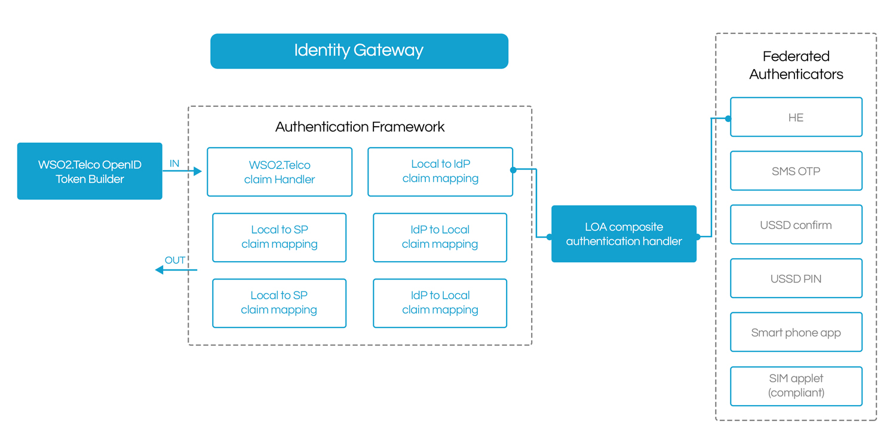
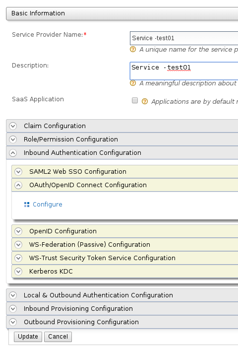
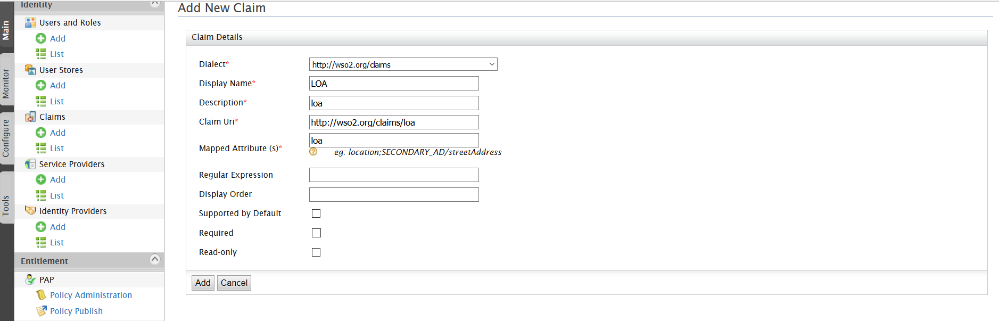

[Introduction to WSO2.Telco]

-   [Introduction]

    -   [Architecture]

    -   [Features]

    -   [2.2 Configurations]

        -   [2.2.1 Database Configuration]

        -   [2.2.3 IDS Configurations]

        -   [2.2.3 Define Service providers in IS management console.\

            ]

    -   [Performance tuning]

-   [User Guide]

    -   [Setup the stubs]

    -   [Install playground application provided by WSO2.]

        -   [Registration Flow]

-   [Disclaimer ]

NOTE: Please see section Terms of Proposal at the end of this\

document for conditions on which this proposal is offered.

Tel: +1 408 754 7388\

Fax: +1 408 689 4328\

Email: <info@wso2telco.com>

1 Introduction to WSO2.Telco 3

2 Introduction 4

2.1 Features 4

3 Deployment Guide 5

3.1 2.1 Environment and prerequisites 5

3.2 2.2 Configurations 5

4 Admin Guide 14

4.1 Monitoring the server 14

4.2 Performance tuning 14

5 User Guide 16

5.1 Setup the stubs 16

5.2 Install playground application provided by WSO2. 16

6 Releases 17

6.1 About This Release 17

7 Disclaimer 18

\

Introduction to WSO2.Telco

==========================

WSO2.Telco Inc., the brain child of a Telco group innovation team and WSO2 Inc., was set up to address the challenges global Telcos’ face staying relevant and competitive in Internet age. The WSO2.Telco digital enablement platform is an open source “internet enabling layer” based on the award winning WSO2 open source middleware technology.

Our technology is the most complete open source platform of its kind for MNOs combining API management, Identity Management, powerful service mapping, efficient orchestration, monetization and reporting with enterprise grade support. It represents a radical departure from the traditional proprietary software licensing / support model, is cloud, PaaS or on premise ready and is horizontally scalable.

Our mission is to continue to embrace and refine new operational concepts and tried and tested open source technologies to achieve scalability & speed to market - whilst eliminating opportunity cost & execution friction for our partners.

Introduction

============

The WSO2.Telco ID Gateway is a standalone solution capable of being the backbone of a fully integrated ID Strategy including SSO, federated ID services and more. The ID Gateway is currently the only fully featured open source GSMA certified ID solution. MNO’s can freely download this component and deploy Mobile Connect or build a PoC by carrying out integrations to their network elements. Further SPs and enterprises can use this solution to implement a federated ID solution for their own use.

For Mobile Connect the WSO2.Telco Identity solution consists of authenticators for Levels of Assurance 2 and 3 (LOA2, LOA3) including Header enrichment, SMS, USSD and Smartphone applications. The solution also works with third party SIM applets and is GSMA Mobile Connect, GSMA OneAPI V3 and ETSI 102.204 compliant.

Architecture

------------

Features

--------

-   Dynamic Authenticator Selection based on

    -   LoA defined in SP OpenID Connect request

    -   User profile attribute

    -   Service Provider profile attribute

-   Supported Authenticators

    -   SMS OTP & Click OK URL

    -   USSD Click OK and Enter PIN

    -   Smartphone application or SDK

    -   Support third party SIM applets via implementation of ETSI TS 102 204

-   Creating new authenticators

-   Extend Java authenticator class and implement relevant custom authenticator

1.  Deployment Guide

    ================

    1.  2.1 Environment and prerequisites

        --------------------------------------------------------------------------------------------------------------------------------

-   WSO2 Telco Ids is Oracle JDK 1.6.\*/1.7.\* compliant. JDK 1.8 is not supported yet. Also OpenJDK is not recommended or supported.

-   It is recommended to use an LDAP like OpenLDAP for user managemente and not recommended to use Apache DS in a production environment due to issues with scalability.

<!-- -->

-   Hardware requirement per instance

  ----------------- ---------------------------------------------------------------------------------------------------------------------------------------------------------------------------------------------------------------------------------------------------------------------------------------------------------------------------------------------------------------

  Physical          -   3 GHz Dual-core Xeon/Opteron (or latest)

                    

                    -   4 GB RAM (2 GB for JVM and 2 GB for the operating system)

                    

                    -   10 GB free disk space

                    

                    Disk space is based on the expected storage requirements that are calculated by considering the file uploads and the backup policies. For example, if three WSO2 product instances are running in a single machine, it requires a 4 GHz CPU, 8 GB RAM (2 GB for the operating system and 6 GB (2 GB for each WSO2 product instance)) and 30 GB of free space.

  Virtual Machine   -   2 compute units minimum (each unit having 1.0-1.2 GHz Opteron/Xeon processor)

                    

                    -   4 GB RAM

                    

                    -   10 GB free disk space

                    

                    -   One CPU unit for the operating system and one for JVM.

                    

                    Three WSO2 product instances running would require VM of 4 compute units, 8 GB RAM and 30 GB free space.

  EC2               -   1 c3.large instance to run one WSO2 product instance.

                    

                    Three WSO2 product instances can be run in 1 EC2 Extra-Large instance. Based on the I/O performance of the c3.large instance, it is recommended to run multiple instances in a larger instance (c3.xlarge or c3.2xlarge).

  ----------------- ---------------------------------------------------------------------------------------------------------------------------------------------------------------------------------------------------------------------------------------------------------------------------------------------------------------------------------------------------------------

> For more information please visit wso2 official documentation. [*https://docs.wso2.com/display/CLUSTER420/Production+Deployment+Guidelines*]

2.2 Configurations

-----------------------------------------------------------------------------------------------------------------

This guide explains how to deploy the **WSO2 Telco IDs** server in standalone mode.

### 2.2.1 Database Configuration

-   The databases are defined in &lt;IS\_HOME&gt;/repository/conf/datasources/master-datasource.xml file. And you need to run the database scripts to setup the required databases

-   Scripts for mysql is provided in &lt;IS\_HOME&gt;/dbscripts/ids/ and if you are using some other database you need to create those databases by yourself.

-   Then provide the correct username and password in &lt;IS\_HOME&gt;/repository/conf/datasources/master-datasource.xml

    1.  ### 2.2.2 Dashboard Configuration

-   Enter the ‘carbon\_url’ and ‘webapps\_url’in the &lt;IS-HOME&gt;/repository/deployment/server/jaggeryapps/portal/site/conf.site.json file.

Eg: for Standalone mode.

{\

"server" : {\

"carbon\_url" : "localhost:9443/",\

"webapps\_url" : "localhost:9763/",\

}\

}

### 2.2.3 IDS Configurations

-   Set below configurations in mobile-connect.xml

> **File Path:**

>

> &lt;IS\_HOME&gt;\\repository\\conf

>

> **Configurations:**

>

> sms endpoint - place sms outbound url

>

> ussd endpoint - place ussd outbound url

>

> If you are using stub {link to 4.2 Setup stubs} to simulate ussd and sms operation place the stub endpoint url

-   Set below configurations to application.properties file in SessionUpdater.

> **File Path :**

>

> &lt;IS\_HOME&gt;/repository\\deployment\\server\\webapps\\SessionUpdater\\WEB-INF\\classes\\

>

> **Configurations :**

>

> subscription.resourceurl -place sms inbound url

>

> sendSMSResourceURL–place sms outbound url

>

> ussdsend–place USSD outbound url

>

> notifyurl–place notify url

>

> accesstoken–place access token

>

> admin\_url-IS URL

>

> **Working Example:**

>

> ssubscription.resourceurl=https://localhost:9444/apicall/smsmessaging/1.0/inbound/subscriptions

>

> sendSMSResourceURL="https://localhost:8243/smsmessaging/v1/outbound/"

>

> startSubscriptionResourceURL="http://localhost:8080/sms/outbound/subscriptions/"

>

> smpp\_port\_1="2645"

>

> smpp\_port\_list="2645;7781;7756;8867"

>

> ussdsend=http://localhost:8080/ussd/v1/outbound

>

> notifyurl=http://localhost:9764/SessionUpdater/tnspoints/endpoint/ussd/pin

>

> accesstoken=8\_r\_ItdMOtN5BvdPD45qGUmYdhAa

>

> shortcode=tel:1721

>

> message=Enter your Mobile ID PIN

>

> retry\_message=Incorrect Pin. Enter PIN again

>

> error\_message=You have entered invalid pin 3 times.Your session is over

>

> keyword=123

>

> admin\_url=https://localhost:9443

-   Set below configurations to application.properties file in user-registration

> **File Path :**

>

> &lt;IS\_HOME&gt;/repository/deployment/server/webapps/user-registration/Whttp://localhost:8080/ussd/v1/outboundEB-INF/classes/com/wso2telco/

**Configurations :**

> ussdsend - place USSD outbound url

>

> notifyurl - place notify url

>

> accesstoken - place access token

>

> loginNotifyurl - place notify url for non NI mobiles

>

> **Working Example :**

>

> ussdsend=http://localhost:8080/ussdstub/v1/outbound

>

> notifyurl=http://localhost:9763/user-registration/webresources/endpoint/ussd/receive

>

> \#Authorization token to access the ussd API

>

> accesstoken=8\_r\_ItdMOtN5BvdPD45qGUmYdhAa

>

> shortcode=tel:1721

>

> \#ussd message

>

> message=Enter your Mobile ID PIN

>

> \#ussd keyword

>

> keyword=3456

>

> \#ussd retry message

>

> retry\_message=Re-enter your PIN

>

> \#ussd error message

>

> error\_message=You have entered invalid pin 3 times.Your session is over

>

> \#identity server URL

>

> isadminurl=https://localhost:9443

>

> \#Identity server admin password

>

> adminpassword=admin

>

> \#Identity server admin username

>

> adminusername=admin

>

> \#Identity Server pin mismatch error

>

> pinmismatch=Pin did not match. Enter PIN again

>

> maxlength=7

>

> \#Waiting time for an user response in minutes

>

> waitinTimeInMinutes=2

>

> \#Pin Format Error

>

> pinformat=You have entered invalid PIN.PIN should be a number of length 4 \~ 6. Enter correct pin.

>

> password=3LYzn3ph

>

> applicationId=APP\_002066

>

> \#User registration sms callback URL

>

> callbackurl=https://identity.example.com/user/webresources/endpoint/sms/response

>

> \#SMS api URL

>

> smsendpoint=https://apimanager.example.com:8243/smsmessaging/v1/

>

> \#User registration ussd callback URL

>

> loginNotifyurl==https://localhost:9443/user-registration/webresources/endpoint/ussd/receive

>

> \#ussd message

>

> loginmessage=Enter your Mobile ID PIN

>

> \#User registration ussd pin callback URL

>

> notifyurlLogin==https://localhost:9443/user-registration/webresources/endpoint/ussd/pin

>

> \#User registration logs

>

> logs=/mnt/10.33.221.165/logs/logs.txt

>

> ussdPushNotifyUrl=https://localhost:9443/user-registration/webresources/endpoint/ussd/push/receive

>

> ussdPushMessage=Login to SP with Mobile Connect?

-   This is an **optional step**. If Mobile country code (Mcc) defined as stage -1 then it would need to put MNC number ranges in mcc\_number\_ranges table in ‘axiatadb’

> MobileCountryConfig.xml

>

> &lt;Mcc&gt;

>

> &lt;Code&gt;413&lt;/Code&gt;

>

> &lt;Stage&gt;1&lt;/Stage&gt;

>

> &lt;DefaultMnc&gt;Dialog&lt;/DefaultMnc&gt;

>

> &lt;/Mcc&gt;

>

> Stage definitions

>

> 0 – Consider DefaultMnc

>

> 1 - Check number ranges to identify Mnc

>

> 2 - Use pathfinder API to identify Mnc

>

> 3 - First check number ranges, if not found falls back to path finder

### 2.2.3 Define Service providers in IS management console.\

> IS Management Console, Service Providers, add

a)  Fill in the **Service Provider Name** and provide a brief **Description** of the service provider. Only **Service Provider Name** is a required field.

b)  Expand the **Inbound Authentication Configuration**/**OAuth/OpenID Connect Configuration** and click **Configure**.

> https://localhost:9444[]

a)  Add callback URL

Eg: for call back rollback for play ground app <https://localhost:9443/playground2/oauth2.jsp>

a)  Fill in the form that appears. For the **Allowed Grant Types** you can disable the ones you do not require or wish to block.

-   **OAuth Client Key** - This is the client key of the service provider, which will be checked for authentication by the Identity Server before providing the access token.

-   **OAuth Client Secret** - This is the client secret of the service provider, which will be checked for authentication by the Identity Server before providing the access token. Click the **Show** button to view the exact value of this.

a)  Expand **Local & Outbound Authentication Configuration**.

b)  Select the Authentication Type as LOA. Then select Advanced Configuration. Select the **Authentication Type** you require from the available options.This should be LOA.Click **Add Authentication Step** to add LOA authenticator.

    1.  ### 2.2.4 Claim management

-   Login to IS carbon console and Go to Home-&gt;claims

-   Select [http://wso2.org/claims ]

Change following claims

Challenge Question 1

> Then go to Challenge question 1 and put Display order as 2 and  select/check 'Supported by Default' and 'Required' checkboxes.

Challenge Question2

> go to Challenge question 2 and put Display order as 3 and select/check 'Supported by Default' and 'Required' checkboxes.

Mobile

> Then go to Mobile-&gt;edit and put Display order as 1 and select/check 'Supported by Default' and 'Required' checkboxes.

Add following claim

Pin\

Then go to Pin-&gt;edit and put Display order as 0 and select/check 'Supported by Default' and 'Required' checkboxes.

> Then select FirstName-&gt;edit.then uncheck 'Supported by Default' and 'Required' checkboxes.Do the same as above to FirstName/LastName/email/Country/url/address claims.

Go to Home-&gt;claims -&gt;Add

> Add LOA claim as below

-   Login to IS carbon console&gt;configure&gt;Claim Management&gt;Claim View.

> Select Add new claim value. Then add a new claim value called 'pin'.

>

> --------

>

> Display Name\* - pin

>

> Description\* - USSD pin

>

> Claim Uri\* http://wso2.org/claims/pin

>

> Mapped Attribute (s)\* - im

>

> Display Order - 0

>

> Supported by Default- true(click the checkbox)

>

> Required -false - Do not click/select the checkbox

>

> Read-only -false - Do not click/select the checkbox

>

> --------

-   Create a Service Provider in IS

Create an Service provider in IS and generate client ID and secret (eg: service provider name SP1)

1.  Admin Guide\

    ===========================================================================================================

    1.  Monitoring the server

        ---------------------

WSO2 Telco ids which is based on WSO2 identity server is a powerful framework for collecting statistical information.

Follow the instructions below to access the statistics feature.

1.  Sign in. Enter your user name and password to log on to the [Management Console].

2.  Navigate to the **Monitor** menu.

Components of the "Monitor" menu are described in the following topics:

-   [System Statistics]

The "**System statistics**" page shows certain statistics related to the WSO2 Identity Server instance. These include free memory, request count, server name, server start time, system up time, active services, total memory, average response time, minimum response time, and maximum response time.

For more information and how to access System Statistics, visit <https://docs.wso2.com/display/IS500/System+Statistics>

-   [System Logs]

The "**System Logs**" page displays information regarding the log files of the current product. Furthermore, it has a feature that allows the user to view and download log files according to their preference.

For more information and how to access System Logs, visit <https://docs.wso2.com/display/IS500/System+Logs>

-   [SOAP Tracer]

The "**SOAP Tracer**" shows SOAP messages, SOAP message requests, and SOAP message responses -- including when the services were deployed on the server and the operations invoked. By default, this feature is turned off. You have to turn it on to enable tracing.

Warning: Turning on the Tracer feature will negatively impact performance. This is because SOAP messages are always completely built (deferred building is not possible) and stored in the database by WSO2 Data Services. Hence, this option should be used with caution.

> For more information and how to access SOAP Tracer, visit <https://docs.wso2.com/display/IS500/SOAP+Tracer>

Performance tuning

------------------

To optimize network and OS performance, you can edit following files in linux systems. \

/etc/sysctl.conf\

/etc/security/limits.conf

For more information, visit <https://docs.wso2.com/display/IS510/Performance+Tuning+Recommendations>

**Change the Client ID and Client Secret of a created SP**

The admin service to be used is 'OAuthAdminService' (you can find the admin services as given in \[1\]).

You can use the operation 'registerOAuthApplicationData' in 'OAuthAdminService' to set ConsumerKey and ConsumerSecret.

To do this, use the attributes oauthConsumerKey and oauthConsumerSecret in OAuthConsumerAppDTO.\

\

However, please note that \*before\* invoking 'OAuthAdminService', you need to have registered a Service Provider. To register a Service Provider, the service to use is 'IdentityApplicationManagementService'.\

\

You may refer to the sample client attached herewith (sample\_client.zip), which shows how to set ConsumerKey and ConsumerSecret using the above admin service.\

Before building the sample, edit 'RelyingPartyAdder.java' file (located in sample\_client/src/main/java/org/wso2/carbon/relying/party/adder) as follows:

1\. Replace '/home/[~~AXIATAMIFEDEV-38~~]/wso2is-5.0.0' with the path to Identity Server Home in your environment.

2\. Update "javax.net.ssl.trustStore" property according to your environment.

3\. If you have changed the default admin username and password, make sure to update those parameters within the main method as well.\

(If you're using a fresh Identity Server pack, you can ignore points \#2 and \#3)

User Guide

==========

> Working with WSO2 Telco Ids

>

> This section explains what are the things, a user can do using this server.

>

> After setting up the server successfully follow the below instructions.

Setup the stubs

---------------

To demonstrate the registration and login flows you need to install ussd and sms stubs. Build the following stubs and deploy those in a webserver.

USSD Stub: <https://github.com/WSO2Telco/ussdstub>

SMS Stub: TBA

Install playground application provided by WSO2.

------------------------------------------------

-   Find the artifact in following location and build it using maven

<https://github.com/wso2/product-is/tree/v5.1.0/modules/samples/oauth2/playground2>

For more information visit [wso2 guide]

-   Copy the built playground2.war to {IDS\_HOME}/repository/deployment/server/webapps/

-   Then start the server by running

> {IDS\_HOME}/bin/wso2server.sh or wso2server.bat

### Registration Flow

-   Go to <https://localhost:9443/pl>*ayground*

-   Provide the required details and continue.

-   Then you will be redirected to Mobile connect portal

-   Provide the mobile number to login or to get registered

1.  Releases

    ========

    1.  About This Release

        ------------------

        1.  ### What's new in this release

The WSO2.Telco ID Gateway stands as the backbone for a fully integrated ID Strategy including SSO, federated ID services and more. MNO’s can freely download this component and experience Mobile Connect and build PoC by carrying out integrations to their network elements. Further SPs can also download this component and implement a federated ID solution for their on use.

The Identity solution consists of fully functioning authenticators for Levels of Assurance 2 and 3 (LOA2, LOA3) for Header enrichment, SMS, USSD, Smartphone applications and SIM applets. Authenticator integration is standard compliant (GSMA OneAPI V3, ETSI 102.204).

WSO2.Telco Identity Gateway version **2.0.0** contains the following new features and enhancements:

Dynamic Authenticator Selection based on

-   LoA defined in SP OpenID Connect request

-   User profile attribute

-   Service Provider profile attribute

Supported Authenticators

-   SMS OTP & Click OK URL

-   USSD Click Ok and Enter PIN

-   Smartphone application or SDK

-   Support SIM applets via implementation of ETSI TS 102 204

Creating new authenticators

-   Extend Java Authenticators Class and implement relevant custom authenticator

Fixed and known issues

-   To explore the fixed issues and known issues in this release, and for other information related to the release, go to: <https://wso2telco.atlassian.net/browse/PRODEV>

Disclaimer 

===========

The purpose of this document is to provide information to the recipient for evaluation purposes only in contemplation of possible discussions with WSO2.Telco concerning the possible supply by WSO2.Telco of services.

This document may be reproduced by the recipient only to the extent necessary for its proper evaluation of the information submitted. The document must not otherwise be copied in whole or in part without the express consent of WSO2.Telco in writing. WSO2.Telco retains all relevant copyrights in this document.

Information contained in this document is proprietary and confidential to WSO2.Telco (and/or its third party licensors) and no rights, licenses or permission are granted with respect to any such information other than the limited rights of use and reproduction expressly stated in this document. That information may be used only for the purposes for which it is disclosed and must not under any circumstances be disclosed to any third party without the express written consent of WSO2.Telco.

No warranty or representation is given by WSO2.Telco in respect of the information contained in this document and any use of or reliance on any of that information is entirely at the risk the person so acting. WSO2.Telco shall have no liability in respect of any use of or reliance on any of such information. Any warranty or representation by or on behalf of WSO2.Telco shall be effective only where and to the extent that it is expressly incorporated into a written contract signed by WSO2.Telco.

This document is neither a contract nor an offer of a contract. Any terms and conditions proposed or to be proposed by the recipient will be reviewed in due course by WSO2.Telco, this document also includes WSO2.Telco’s relevant standard terms and conditions. WSO2.Telco submits this document on the basis that all and any conditions warranties and representations and other terms applicable to the licensing and supply by WSO2.Telco of any technology or the provision by WSO2.Telco of any services are to be negotiated and incorporated in an appropriate signed contract.
